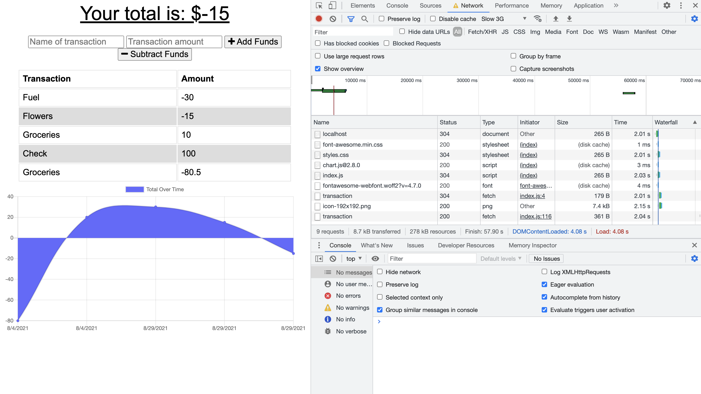
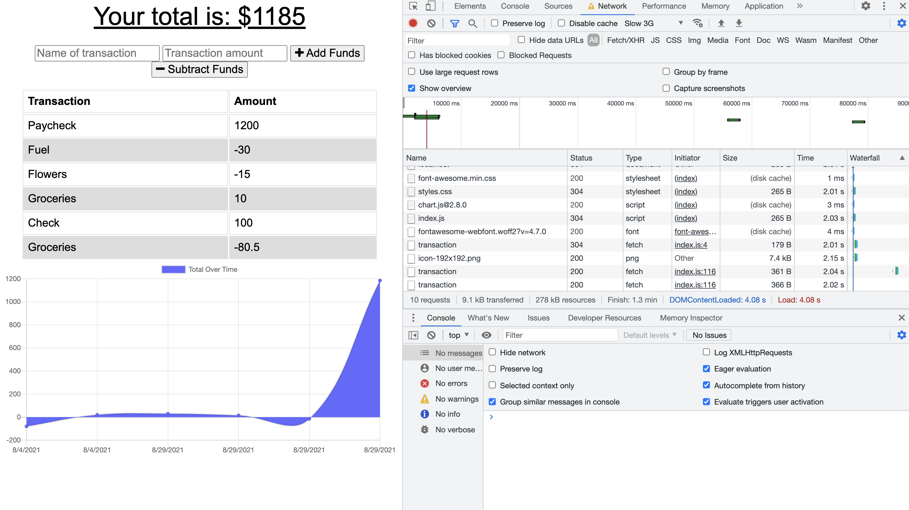

# BudgetTracker

Budget Tracker application that allows for offline access and functionality

## Goal:

The goal was to utilize indexdb to connect a database in order to be create an application that can enter deposits offline, enter expenses offline and when brought back online adds that data.

## Issues:

- Need to re-visit the webpack config file and connect it properly.

## Results:

I was able to successfully use a mongoose database to record transaction data. I was able to use express and connect the pages. I was also able to use the app on and offline.

#### Transaction starting point.

#### After Adding a deposit

### Github Link:

https://github.com/sbgastondesign/BudgetTracker

### Heroku Link:

https://limitless-fjord-97515.herokuapp.com/

## Future Updates:

- Review webpack.

### License

MIT License, Copyright (c) [2021] [StephanieGaston]

---

### Contact:

- Email: sbgastondesign@gmail.com
- Github: github.com/sbgastondesign
- LinkedIn: "http://www.linkedin.com/stephanie-gaston-1067217a/"
